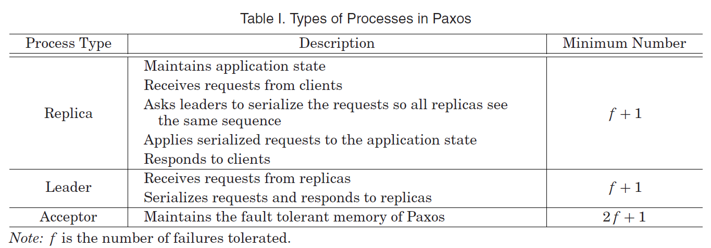
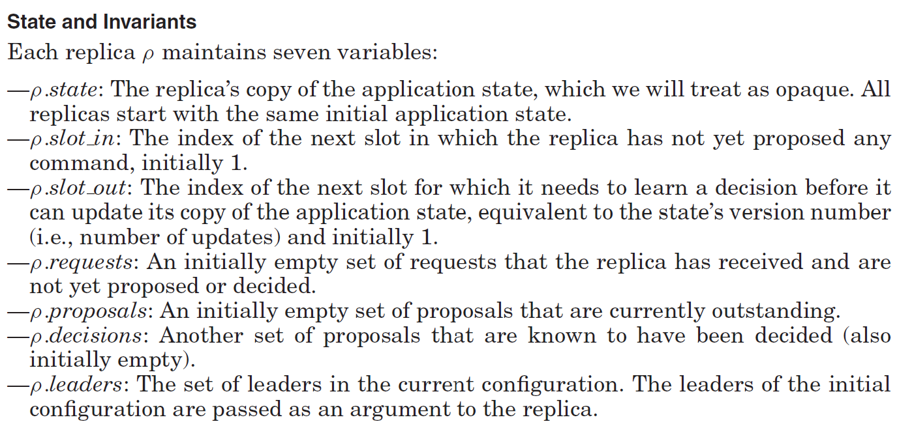
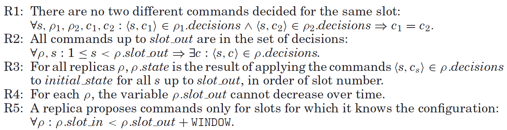

# Notes on Various Paxos Sources

## Paxos Made Moderately Complex
Abstract: This article gives an operational description of a reconfigurable version o fthe multidecree Paxos protocol, sometimes called multi-Paxos.

Paxos [Lamport 1998] is a protocol for state machine replication in an asynchronous environment that admits crash failures.

State machine: the deterministic serice whose operations require a consensus algorithm to replicate consistently across multiple nodes.

A state machine consistes of a collection of states, transitions between states, and a current state. Transitions to the current state to the same state are allowed and are used to model read-only operations.

In a deterministic state machine, for any state and operation, the transition enabled by the operation is unique and the output is a function only of the state and the operation. Logicaly, a deterinistic state machine handles one operation at a time.

Byzantine failures are not allowed in Paxos. Only benign failures are allowed.

State machine replication (SMR) is a technique to mask failures, particularly crash failures. Replicas of a deterministic state machine are provided with the same sequence of operations to arrive at identical states with the same sequence of outputs. One or replicas can crash except for one, and we do not know which ones crash or not.

### Paxos Mechanics
Clients sends commands to a server over a network and await an output:
`<k, cid, operation>`
k is an identifier of the client that issued the command
cid is a unique sequence number corresponding to a single command issued by a single client at a single point in time

***
A stub routine is used on the client side to give the illusion of a single remote server that is highly available, whereas the stub routine broadcasts the command to all replicas and returns only the first response to the command.
***

Concurrent commands may arrive in different orders at different replicas. A consistency protocol like Paxos ensures the replicas all end up in the same state.

Assumption: messaging between correct processes is reliable but not necessarily FIFO:
* A message sent by a nonfaulty process to a nonfaulty destination process is eventually received (***at least once***)
* If a message is received by a process, it was sent by some (possibly faulty) process

Reconfiguration can be used in Paxos after a crash to replace a crashed process with a fresh one to maintain the ability of Paxos to tolerate failures.

Single-decree Paxos is easier to understand, but Multi-decree Paxos is the one used by industrial-strength sysstems like Google's Chubby.

The paper presents, without proofs, invariants for each operation that can be checked to ensure correctness. **If an invariant holds before the operation, it will hold after the operation**.



Leaders and acceptors are specialized processes that coordinate replicas.

When client ***k*** executes a command, its stub routine broadcasts a `<request, c>` message to all replicas and waits for a `<response, cid, result>` message from one of the replicas.

Replicas store a sequence of commands, each in a slot, making up the inputs of the state machine. Slots are indexed by a slot number. When a replica receives a request from a client, it proposes the corresponding command for its lowest unused slot. We call the pair `(s, c)` a ***proposal*** for slot s.

#### Configuration of the slot

Leaders and acceptors are processes that run the `configuration of the slot`, which is the consensus protocol used to select a single command from the different proposals across the replicas for the same slot, ensuring consistency across separate replica processes.

Leaders decide a single command for the slot. Replicas use this `decision` to update its state and computing a response to send back to the client that issued the request.

The configuration of the slot may sometimes be inconsistent at times across the leaders, such as when a process in the configuration is suspected of having crashed.


"Paxos supports reconfiguration: a client can propose a special reconfiguration command, which is decided in a slot just like any other command. However, if s is the index of the slot in which a new configuration is decided, it does not take effect until slot s + WINDOW. This allows up to WINDOW slots to have proposals pending—
the configuration of later slots may change. It is always possible to add new replicas—this does not require a reconfiguration of the leaders and acceptors."

#### State and Invariants





A replica runs in an infinite loop, receiving messages. Replicas receive two kinds of messages: reqests and decisions. 
* Request (from client)

  * Add request with command *c* to set *requests*
  * Invoke `propose()`, which performs the following steps:

    * Identify any unused slots within the window of slots with known configurations: for each slot *s*, check if the configuration for *s* is different from the prior slot by checking if the decision is slot *s - WINDOW* is a reconfiguration command. If so, update the set of leaders for slot *s* and remove request *r* from *requests* and add proposal (s, r) to the set *proposals*. Finish by sending (**propose**, *s*, *c*) message to all leaders in the configuration of slot *s*.
    
    `propose()`
    transfers request to set of proposals if 


**Slots**

The Paxos log is a totally ordered sequence of numbered slots (1, 2, 3, …). Each slot holds exactly one decided command. The goal is for all replicas to agree on the same command in every slot, so they all execute the same sequence.

---

**`slot_in`**

The next slot not yet assigned a proposal. As the replica pulls requests from its pending `requests` set and proposes them to leaders, it increments `slot_in`. Think of it as the "write head" — the frontier of what has been proposed.

---

**`slot_out`**

The next slot whose decision has not yet been executed. Because commands must be applied in order (slot 1 before slot 2, etc.), the replica can only advance `slot_out` once the decision for that slot arrives. Think of it as the "execute head."

The gap between `slot_out` and `slot_in` is the set of slots that are *proposed but not yet executed*.

---

**The Window (`WINDOW`)**

The window caps how far ahead of `slot_out` the replica is allowed to propose:

$$\text{slot\_in} < \text{slot\_out} + \text{WINDOW}$$

This serves two purposes:

1. **Flow control** — limits the number of concurrent in-flight proposals so the system doesn't get arbitrarily far ahead.

2. **Reconfiguration safety** — when proposing slot $s$, the replica checks whether slot $s - \text{WINDOW}$ held a reconfiguration command. Because the window guarantees that slot $s - \text{WINDOW}$ must already be *decided* before slot $s$ is proposed, the replica always has a known, stable configuration for every slot it proposes into. Without the window, a reconfiguration could take effect before the replica knows about it.

---

**Putting it together**

```
slot_out          slot_in        slot_out + WINDOW
   |                 |                  |
   v                 v                  v
[executed] [decided] [proposed] [open slots] | [forbidden]
                     <-------- window ------->
```

`propose()` iterates slots from `slot_in` up to (but not including) `slot_out + WINDOW`, assigning one pending request per slot, and sending `⟨propose, s, c⟩` to the leaders of that slot's configuration.


Clients
Replicas
Slots
Configurations


#

#### Traits, Generics and Application State Machine (Rust Generic)

A trait is a contract for what an object type must do. The implementation that fulfills the contract is a concrete type or implementor.

Here’s a clean, precise, systems‑programmer‑level explanation of what this Rust code is doing. I’ll break it down into the trait, the blanket impl, and the generic server struct, because each piece is expressing a different part of the Paxos type‑system contract.
🧠 What PaxosApp Actually Means
rust

pub trait PaxosApp:
    framework::Application<Command: PaxosCommand, Result: PaxosResult>
    + Serialize
    + DeserializeOwned
{
}

This is a trait alias pattern (pre‑trait‑alias Rust) used to express a bundle of required capabilities.
In plain English:

A PaxosApp is any type A that:

    Implements
    framework::Application  
    with the additional constraint that

        A::Command: PaxosCommand

        A::Result: PaxosResult

    Implements Serialize

    Implements DeserializeOwned

This is exactly how you express:

    “Any application used inside Paxos must be serializable, deserializable, and have commands/results that satisfy Paxos semantics.”

This is a trait with no methods — it exists purely to bundle constraints.
🧩 Why the Blanket Implementation Exists

```rust
impl<A> PaxosApp for A
where
    A: framework::Application + Serialize + DeserializeOwned,
    A::Command: PaxosCommand,
    A::Result: PaxosResult,
{
}
```

This is the key piece.
What it does:

It says:

    “For any type A that satisfies all the required bounds, automatically treat it as a PaxosApp.”

This is a blanket impl, similar to how the standard library does:

```rust
impl<T: Display> ToString for T { ... }
```

Why it’s needed:

Because the trait itself has no methods, Rust needs an implementation to “seal” the trait alias pattern. Without this blanket impl, nothing would actually implement PaxosApp.

This is the canonical way to simulate trait aliases before they exist in stable Rust.
🏗️ The Generic Paxos Server

```rust
pub struct GenericPaxosServer<A: PaxosApp> {
    pub address: Address,
    pub servers: Vec<Address>,
    pub app: GenericAMOApplication<A>,
}
```

This struct is parameterized over any application A that satisfies PaxosApp.

That means:

    The server can run any replicated state machine

    As long as that state machine:

        Has commands/results compatible with Paxos

        Is serializable/deserializable

        Implements the framework’s Application trait

This is exactly how you build a generic replicated state machine on top of Paxos.
The constructor:

```rust
impl<A: PaxosApp> GenericPaxosServer<A> {
    pub fn new(address: Address, servers: Vec<Address>, app: A) -> Self {
        GenericPaxosServer {
            address,
            servers,
            app: GenericAMOApplication::new(app),
        }
    }
}
```

This wraps the user’s application A inside a Generic AMO (Atomic Multicast Order) application, which is the replicated state machine layer.
🧱 The TODO Methods

These are placeholders for the student to implement Paxos state:

```rust
pub fn status(&self, _log_slot_num: u64) -> PaxosLogSlotStatus
pub fn first_non_cleared(&self) -> u64
pub fn last_non_empty(&self) -> u64
```

These correspond to:

    status → what’s in a given log slot (Empty, Chosen, Accepted, etc.)

    first_non_cleared → the earliest slot not yet garbage‑collected

    last_non_empty → the highest slot with any Paxos value

These are standard pieces of a Paxos log.
🧠 Why This Design Matters (Non‑Obvious Insight)

This pattern is a type‑safe enforcement of Paxos’s replicated state machine model.

Paxos itself doesn’t care what your commands or results are — but your replicated state machine must:

    be deterministic

    be serializable

    have well‑defined command/result types

By encoding these constraints in the type system, the framework prevents entire classes of bugs:

    non‑serializable commands

    mismatched command/result types

    using an application that doesn’t satisfy Paxos semantics

This is exactly the kind of design you’d expect in a research‑grade or production‑grade consensus framework.
🎯 If you want, I can also walk you through:

    how PaxosCommand and PaxosResult should be designed

    how to implement the Paxos log state machine

    how GenericAMOApplication wraps your app

    how to structure ballots, acceptor state, and proposer state

Which direction do you want to go next?

#

Another Answer:

Here’s the clean, precise explanation of what your Rust code is doing — why the trait exists, what the bounds mean, and how the generic server struct uses it. I’ll break it down in the way a distributed‑systems engineer (like you) actually thinks about Paxos.
🧠 What PaxosApp Actually Means

This line defines a trait alias pattern using a real trait:

```rust
pub trait PaxosApp:
    framework::Application<Command: PaxosCommand, Result: PaxosResult>
    + Serialize
    + DeserializeOwned
{}
```

This means:

    Any type A that wants to be used as the application logic inside your Paxos replicated state machine must satisfy all of these constraints.

Let’s unpack each constraint.
🧩 1. `framework::Application<Command: PaxosCommand, Result: PaxosResult>`

This says:

    The application must implement the Application trait from your framework.

    Its associated type Command must implement PaxosCommand.

    Its associated type Result must implement PaxosResult.

This is the classic replicated‑state‑machine pattern:

    Command = client request

    Result = deterministic output

    Paxos orders commands → your app applies them → produces results

So PaxosApp is enforcing that your application is compatible with the Paxos log.
🧩 2. + Serialize + DeserializeOwned

Your application must be:

    Serializable (to send over the network)

    Deserializable (to reconstruct state on other replicas)

This is required because Paxos replicas exchange:

    proposals

    accepted values

    application state (in some implementations)

🧠 Why the `impl<A>` PaxosApp for A Exists

```rust
impl<A> PaxosApp for A
where
    A: framework::Application + Serialize + DeserializeOwned,
    A::Command: PaxosCommand,
    A::Result: PaxosResult,
{}
```

This is a blanket implementation.

It means:

    Any type A that satisfies the bounds automatically implements PaxosApp.

You don’t manually implement PaxosApp.
You just implement Application, Serialize, and DeserializeOwned, and ensure your associated types satisfy the Paxos traits.

This is a common Rust pattern for “trait aliases before trait aliases existed.”
🏗️ How `GenericPaxosServer<A>` Uses It

```rust
pub struct GenericPaxosServer<A: PaxosApp> {
    pub address: Address,
    pub servers: Vec<Address>,
    pub app: GenericAMOApplication<A>,
}
```

This says:

    The server is generic over any application that satisfies PaxosApp.

    The server embeds a GenericAMOApplication<A> — this is your replicated state machine wrapper.

So the server is:

    A Paxos node that can run any deterministic application that satisfies the PaxosApp trait bounds.

This is exactly how systems like etcd, ZooKeeper, and Chubby embed their state machines.
🧠 Why the trait is needed at all

Because Paxos is application‑agnostic.

Your Paxos implementation:

    orders commands

    ensures consistency

    handles ballots, logs, acceptors, proposers, learners

But it does not know what the commands mean.

PaxosApp is the contract that lets you plug in:

    a key‑value store

    a lock service

    a metadata service

    a replicated queue

    anything deterministic

This is the same architecture as:

    Raft’s StateMachine trait

    ZooKeeper’s ZAB replicated database

    Multi‑Paxos in Chubby

🧠 The GenericPaxosServer methods

These are placeholders for the student to implement:

```rust
pub fn status(&self, _log_slot_num: u64) -> PaxosLogSlotStatus
pub fn first_non_cleared(&self) -> u64
pub fn last_non_empty(&self) -> u64
```

These correspond to:

    status → what’s in a given log slot? (Empty / Chosen / Accepted / etc.)

    first_non_cleared → garbage collection boundary (like Raft’s first_log_index)

    last_non_empty → highest slot with a value

These are essential for:

    prefix trimming

    snapshotting

    log compaction

    catch‑up for slow learners

🧠 Summary (the short version)

PaxosApp is a trait alias that says:

    “Any application used inside Paxos must implement Application, be serializable, and have Paxos‑compatible Command and Result types.”

The blanket impl means:

    “If you satisfy the bounds, you automatically are a PaxosApp.”

`GenericPaxosServer<A>` is a Paxos node that can run any such application.

If you want, I can also walk you through:

    how to implement the Paxos log state

    how to structure ballots, acceptor state, and proposer state

    how to implement Multi‑Paxos optimizations

Just pick one and I’ll go deep.

#

Both are generic through Rust's type parameter system, layered as follows:

**`GenericAMOApplication<A>`** (amo.rs)

- Generic over `A: framework::Application`, meaning any type that implements the `Application` trait (has an `execute(Command) -> Result` method).
- It wraps `A` with at-most-once (AMO) deduplication: it stores `last_results: BTreeMap<Address, GenericAMOResult<A::Result>>` and short-circuits re-execution if the same `(client, seq_num)` is seen again.
- Because it's generic over `A`, it works with `KVStore` in Lab 3, or `ShardMaster` in Lab 4, without any code changes.

**`GenericPaxosServer<A: PaxosApp>`** (server.rs)

- Generic over `A`, constrained by the `PaxosApp` trait — which itself requires `A` to be a `framework::Application` whose `Command`/`Result` types are serializable and hashable.
- It holds `app: GenericAMOApplication<A>`, so the application type flows through both layers.
- The `GenericMsg<A::Command, A::Result>` message type (used in `Node::Msg`) is also derived from `A`, so the entire message protocol adapts to whichever application is plugged in.

**The chain:**
```
KVStore  (implements Application)
  ↓ wrapped by
GenericAMOApplication<KVStore>   (adds deduplication)
  ↓ held by
GenericPaxosServer<KVStore>  (alias: PaxosServer)
```

The `PaxosApp` trait bound just ensures that whatever `A` you plug in, its command/result types satisfy the serialization and hashing requirements needed for Paxos log entries and network messages.

#

Let’s take your two questions one at a time, because they touch on **Rust type‑system design** and **distributed‑systems architecture** — and they’re both subtle.

---

# 1) **“This is the canonical way to simulate trait aliases before they exist in stable Rust.”**  
### What that sentence means

Rust *still* doesn’t have full trait aliases on stable. A trait alias would let you write:

```rust
trait PaxosApp = Application + Serialize + DeserializeOwned;
```

…but Rust doesn’t support that yet.

So the community uses a **pattern**:

### Step 1 — Define an empty trait with supertrait bounds

```rust
pub trait PaxosApp:
    Application + Serialize + DeserializeOwned
{}
```

This trait has **no methods**. It only exists to bundle constraints.

### Step 2 — Provide a blanket implementation

```rust
impl<A> PaxosApp for A
where
    A: Application + Serialize + DeserializeOwned,
{}
```

This says:

> “Any type that satisfies the bounds automatically implements PaxosApp.”

### Why this simulates a trait alias

Because now you can write:

```rust
fn run_paxos<A: PaxosApp>(app: A) { ... }
```

…and it behaves exactly like a trait alias would behave.

This pattern is used everywhere in the Rust ecosystem (Tokio, Axum, Serde, etc.) to express “bundles of traits” before Rust has real trait aliases.

---

# 2) **“Why would ZooKeeper embed any state machine? Isn’t the state machine the distributed database that *uses* ZooKeeper?”**

This is a *very* common misconception, so let’s clear it up cleanly.

---

# 🧠 ZooKeeper *is* a replicated state machine  
ZooKeeper is not a coordination service that sits next to a database.  
ZooKeeper **is itself** a replicated state machine built on top of ZAB (its Paxos‑like protocol).

### ZooKeeper’s internal architecture:

- It has a **log** of client operations (setData, create, delete, etc.)
- It orders them using ZAB (atomic broadcast)
- Every server applies the operations to a **local in‑memory tree**  
  (the znodes: `/foo/bar`, `/locks/x`, etc.)

That tree **is the state machine**.

### ZooKeeper’s state machine is not pluggable  
Unlike your Paxos framework, ZooKeeper does **not** allow arbitrary user‑defined state machines.  
Its state machine is fixed:

- a hierarchical namespace  
- ephemeral nodes  
- watches  
- versioned data  
- ACLs  

But it *is* a state machine.

---

# 🧠 Why people think “ZooKeeper is used *by* databases”

Because ZooKeeper is often used as:

- a lock service  
- a membership service  
- a configuration store  
- a leader election service  

So databases (HBase, Kafka, Hadoop) use ZooKeeper for coordination.

But internally, ZooKeeper is a replicated state machine — just like etcd, Consul, or Chubby.

---

# 🧠 Why your Paxos framework *does* embed a pluggable state machine

Your framework is implementing the **replicated state machine pattern**:

> Consensus orders commands →  
> every replica applies them →  
> the application state evolves deterministically.

This is the same pattern used by:

- Raft (applies log entries to a user‑defined state machine)
- Multi‑Paxos (Chubby)
- Viewstamped Replication
- etcd (applies operations to a key‑value store)
- ZooKeeper (applies operations to a znode tree)

The difference is:

### ZooKeeper  
State machine is **fixed** (znode tree).

### Your Paxos framework  
State machine is **generic** (any `PaxosApp`).

---

# 🧠 Why ZooKeeper *must* embed a state machine

Because consensus protocols don’t store “data” — they store **ordered operations**.

Something must:

1. Receive the ordered operations  
2. Apply them deterministically  
3. Maintain the authoritative state  

That “something” is the state machine.

If ZooKeeper didn’t embed a state machine, it would just be a log.  
But clients need:

- znodes  
- ephemeral nodes  
- watches  
- version numbers  
- ACLs  

Those are all state‑machine semantics.

---

# 🧠 Summary

### ✔ “Simulating trait aliases”  
Means: using an empty trait + blanket impl to bundle trait bounds before Rust supports real trait aliases.

### ✔ ZooKeeper absolutely *does* embed a state machine  
It’s a replicated hierarchical key‑value store.  
Databases use ZooKeeper for coordination, but ZooKeeper itself is a replicated state machine.

---

If you want, I can also explain:

- how ZAB differs from Paxos  
- how ZooKeeper’s state machine is structured internally  
- why Raft exposes a pluggable state machine but ZooKeeper doesn’t

Which direction do you want to go?

#

Great question. In practice, the colocation is a **design choice**, not a limitation. Here's how real systems handle it:

---

**What this lab is doing is already production-pattern**

Multi-Paxos and Raft in production (etcd, CockroachDB, TiKV, Kafka's KRaft) colocate all roles on every node. Every server simultaneously acts as:
- Replica (applies decisions to state machine)
- Leader candidate / follower
- Acceptor (votes on proposals)

This is the norm, not a simplification. PMMC separates them conceptually for clarity of proof, not for deployment.

---

**Scaling to Kubernetes in practice**

The unit of deployment is the **server process**, not the role. You'd have:

```
StatefulSet:
  paxos-server-0  ← runs GenericPaxosServer (all roles)
  paxos-server-1  ← runs GenericPaxosServer (all roles)
  paxos-server-2  ← runs GenericPaxosServer (all roles)
```

Each pod gets a stable DNS name (`paxos-server-0.paxos-svc`), and `Address` becomes a hostname:port. The framework's `out.send(addr, msg)` becomes a real network call (gRPC, TCP, etc.).

---

**The only thing that changes is the transport layer**

Your `handle()`, `propose()`, and all the Paxos logic stays identical. What changes:

| Lab framework | Production |
|---|---|
| `out.send(addr, msg)` | gRPC / TCP socket write |
| `out.set_timer(...)` | Tokio `sleep` / `interval` |
| In-process message delivery | Network serialization (your types already derive `Serialize`) |
| `Address` = opaque ID | `Address` = `host:port` |

Your types already derive `Serialize`/`Deserialize` precisely for this reason — the framework is designed so the same message structs work over the wire.

---

**What etcd actually looks like**

etcd's Raft implementation (`go.etcd.io/raft`) has the exact same structure as your code — a `Node` interface with `Step(msg)` (equivalent to `handle`) and `Tick()` (equivalent to `on_timer`). The application layer wraps it with a real network transport. The consensus logic is completely transport-agnostic.

#

## Prepare & Promise in Paxos Made Moderately Complex

These are the two messages of **Phase 1** (the "scouting" phase), used by a leader trying to claim a new ballot number `b`.

### Phase 1 flow

1. **Prepare(b)** — Leader (via a *scout*) broadcasts this to all acceptors. It's a request: "I want to become the leader for ballot `b`. Will you stop accepting lower ballots?"

2. **Promise(b, pvals)** — An acceptor replies if `b` is greater than any ballot it has already promised (`b > b_max`). Crucially, it includes **all pvalues it has already accepted** in its response.

Once the leader hears Promise from a **quorum**, Phase 1 is complete and it moves to Phase 2 (Accept/Accepted/Decide).

---

### pvalue — the core data structure

A **pvalue** is a triple:

$$\langle b,\ s,\ c \rangle$$

| Field | Meaning |
|---|---|
| `b` | ballot number |
| `s` | slot number |
| `c` | command proposed for that slot |

It means: *"In ballot `b`, slot `s` was proposed command `c` (and I, an acceptor, accepted it)."*

---

### The connection

The Promise messages are the mechanism by which pvalues flow back to the leader. After collecting a quorum of Promises, the leader computes **pmax** over all received pvalues:

$$\text{pmax}(\alpha, \beta) = \{ p \in \alpha \cup \beta \mid \nexists\, q \in \alpha \cup \beta : p.\text{slot} = q.\text{slot} \land p.b < q.b \}$$

For each slot, keep only the pvalue with the **highest ballot number**. The leader must then re-propose those commands in Phase 2 — this is the safety guarantee: it cannot overwrite a value that a previous leader may have gotten decided.

If no pvalue exists for a slot, the leader is free to propose its own command.

**In short:** Prepare/Promise are the *protocol messages*; pvalue is the *data* carried by Promise that enforces Paxos safety across leader changes.

#

Direct mapping — the letter names come from Lamport's original papers, the word names from Paxos Made Moderately Complex:

| Short name | Full name | Direction | Phase |
|---|---|---|---|
| **p1a** | **Prepare** | Leader → Acceptors | Phase 1 |
| **p1b** | **Promise** | Acceptors → Leader | Phase 1 |
| **p2a** | **Accept** | Leader → Acceptors | Phase 2 |
| **p2b** | **Accepted** | Acceptors → Leader | Phase 2 |

The "a" suffix = the *request*, the "b" suffix = the *response*. Phase 1 establishes ballot ownership (and collects pvalues via p1b). Phase 2 actually gets values decided.

`Decide` (broadcast of a chosen value) has no p-name equivalent in classic single-decree Paxos — it's a multi-Paxos addition to avoid every replica needing to re-run Phase 2 queries.


#


Replica propose function:

While `slot_in` is less than `slot_out + WINDOW` **and** there exists some command `c` in `requests`:

1. If there exists an operation `op` such that the decision at slot `slot_in - WINDOW` has `op` as its command **and** `op` is a reconfiguration command, then: update `leaders` to be the new leader set specified by `op`.

2. If there does **not** exist any command `c'` such that `(slot_in, c')` is already in `decisions` (i.e., slot `slot_in` is not yet decided), then:
   - Remove `c` from `requests`
   - Add `(slot_in, c)` to `proposals`
   - For every leader `λ` in `leaders`: send `λ` the message `(propose, slot_in, c)`

3. Set `slot_in` to `slot_in + 1`

#

Replica Function Perform:
`perform` takes a triple `(κ, cid, op)` where `κ` is the client address, `cid` is the command ID, and `op` is the operation to execute.

If **either**:
- there exists some slot `s` such that `s < slot_out` **and** the decision at slot `s` is this same command `(κ, cid, op)` (i.e., this command was already executed in an earlier slot), **or**
- `op` is a reconfiguration command

Then: simply increment `slot_out` by 1 (skip execution — either it's a duplicate or reconfigs don't produce a client reply).

Otherwise (normal, first-time execution):
1. Execute `op` against the current `state`, producing `next` (the new state) and `result` (the output)
2. Atomically: update `state` to `next` and increment `slot_out` by 1
3. Send `(response, cid, result)` back to client `κ`

---

The duplicate check (`∃s < slot_out`) is the AMO (at-most-once) mechanism — if the same command was already decided and executed in a previous slot, don't execute it again, just advance `slot_out`.

#

Replica main routine:
Loop forever, waiting for a message, then handle it:

**Case `(request, c)`** — a client sent a command `c`:
- Add `c` to `requests`.

**Case `(decision, s, c)`** — a leader has decided command `c` for slot `s`:
- Add `(s, c)` to `decisions`.
- Then, while there exists a command `c'` already decided for `slot_out` (i.e., the next slot we need to execute is ready):
  - If we had previously proposed some command `c''` for `slot_out`:
    - Remove `(slot_out, c'')` from `proposals` (that proposal is now resolved).
    - If `c'' ≠ c'` (the leader chose a *different* command than what we proposed): put `c''` back into `requests` so it gets proposed again in a later slot.
  - Call `perform(c')` to execute the decided command and advance `slot_out`.

**After handling either case:** call `propose()` to try to fill new slots with pending requests.

---

The inner while loop is what drives execution forward — decisions can arrive out of order, so it keeps executing as long as the *next* slot in sequence (`slot_out`) has a decision ready. The re-queuing of `c''` ensures no client command is silently dropped when a leader picks a different value for a slot.

#

In Perform, Why does the pseudo code say "for every" when there can only be one instance in decisions with a client, seq_num, and command combo?

Because PMMC doesn't assume AMO — the `∃s` check in `perform()` **is** PMMC's deduplication mechanism. Without a separate AMO layer, the same `⟨κ, cid, op⟩` triple genuinely can appear in `decisions` at multiple slots:

- A client retransmits an unacknowledged request
- Two different replicas independently propose it into two different slots
- Both slots get decided (Paxos guarantees one value *per slot*, not one slot *per command*)

The `∃s : s < slot_out` check catches this: "have I already executed this exact command in a prior slot? If yes, skip it and just advance `slot_out`."

In your implementation, `GenericAMOApplication` already provides this deduplication via `(client, seq_num)` tracking, so the `∃s` search is somewhat redundant — but it's still necessary for correctness according to the spec, because the proposals layer might not prevent duplicates across slots in all failure scenarios. The check is cheap and defensive.